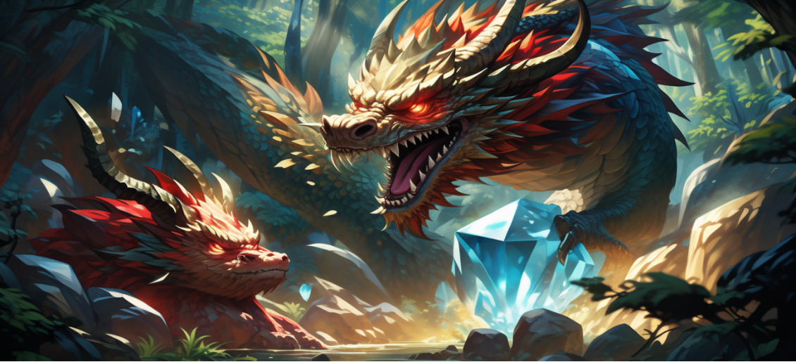

# Gem and Dragon Knowledge Representation Report

## 1. Game Overview
“Gem and Dragon” is a text-based adventure game in which players take on the role of an intrepid explorer into a mysterious and dangerous forest with the goal of retrieving the gems in dungeon and defeating the dragon, as players explore the map and collect key items to win the game.

## 2. Game Design
By using generative AI from Baidu [1], I made some design poster of the game. A dangerous dragon in the mysterious forest.

## 3. Playing Instruction
First, open the file with SWI-Prolog and type “start.” to start the game. The game consists of several scenes: village, castle, forest, river, cave, dungeon, campsite. Players need to unlock the map by collecting items, for instance a torch is needed to get into the cave and a key is needed to get into the dungeon. Player also need to earn coins by fishing at the river, and use the coins to buy weapons from blacksmith in the village. After obtaining sword, shield, and ruby, player can challenge to defeat the dragon and win the game.

## 4. Knowledge Base Design
The knowledge base in "Gem and Dragon" is constructed using dynamic predicates in Prolog, allowing for a flexible and interactive game environment. The predicates at/2, i_am_at/1, alive/1, coins/1, and has_ruby/0 manage the game state, tracking the player's location, the dragon's status, and the possession of items. I set some initial states when game started, for example “i_am_at(forest)”, “coins(0)” and “alive(dragon)”, which means the players will start the game in forest with no coins, and they need to kill the dragon to win the game.

The choice to use dynamic facts and rules was driven by the need for a responsive game that adapts to player actions, each of them is necessary for the game. For instance, the take/1 and drop/1 predicates modify the player's inventory, while path/3 defines the navigable paths between locations and at/2 defines the location of items. The game logic is encapsulated in rules that govern movement, item interaction, and combat, ensuring a coherent experience.

## 5. Main Gameplay Mechanics
The game introduces an inventory system managed through the at/2 predicate, which tracks both the player's current holdings and the items' locations within the game world. The take/1 and drop/1 predicates facilitate item acquisition and release, respectively, with checks to ensure logical consistency, such as not being able to pick up an item already in the player's possession.

Movement is handled by the go/1 predicate, which checks the player's current location and the desired direction, updating the game state accordingly. The look/0 predicate provides a descriptive response of the player's surroundings and any notable objects. Additionally the player can use map/0 to see the map of the game, it shows the path to each places.

Combat is a critical aspect of "Gem and Dragon," with the kill/0 predicate determining the outcome of battles. The game checks for the necessary conditions to defeat the dragon, such as possessing the ruby, sword, and shield, and being in the forest.

Currency system is also a big feature of the game, the only way to get a sword is to buy it from the blacksmith in village, so the player need to figure out the way to get coins. By using fish/0, player can fish by the river to earn coins, however I used a random method to make sure players can't catch a fish every time.

## 6. Gameplay Rules and Logic
The rules of the game are implemented through a series of Prolog clauses that define the conditions for winning, losing, and managing the player's inventory. The game's logic is underpinned by arithmetic functions, such as in the management of coins, which are necessary for purchasing the sword.

Therefore, a series of rules were set for getting items, discarding items, moving, entering new places, observing the environment, killing dragons, buying items, fishing and ending the game.

The game's win condition is met when the player, equipped with the ruby, sword, and shield, defeats the dragon in the forest. Conversely, the player loses if they attempt to fight the dragon without the necessary items or if they are captured by guards in the castle when taking the key.

## 7. Inspiration
"Gem and Dragon" is a classical and popular theme in many computer games, killing the evil dragon and finding the lost treasures. In addition, I was also inspired by two famous games, “Minecraft” [2] and “Stardew Valley” [3], they gave players a chance to explore free and earn equipment by themselves, so I added village and river where players could earn coins by fishing and buy items from the blacksmith in village. The result of fishing is random, if the player is lucky, he will soon collect for enough money and get the main equipment to win the game, otherwise he may need some extra effort to get the coins. So this mechanism also add some uncertainty and fun to the game.

## 8. Reference
[1] Baidu. Creation Mode. Yige. [https://yige.baidu.com/creation?mode=1](https://yige.baidu.com/creation?mode=1). November 4, 2024

[2] Mojang Studios. "Minecraft." [https://www.minecraft.net/en-us](https://www.minecraft.net/en-us). November 4, 2024.

[3] Stardew Valley. "Stardew Valley Wiki." [https://www.stardewvalleywiki.com/Stardew_Valley _Wiki](https://www.stardewvalleywiki.com/Stardew_Valley_Wiki). November 4, 2024.
